## template

### 3分割テンプレート

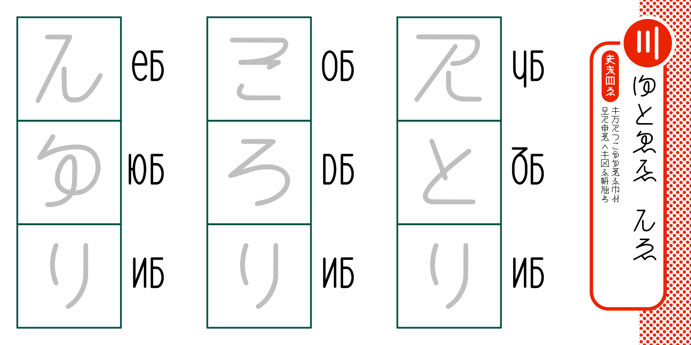


### 4分割テンプレート

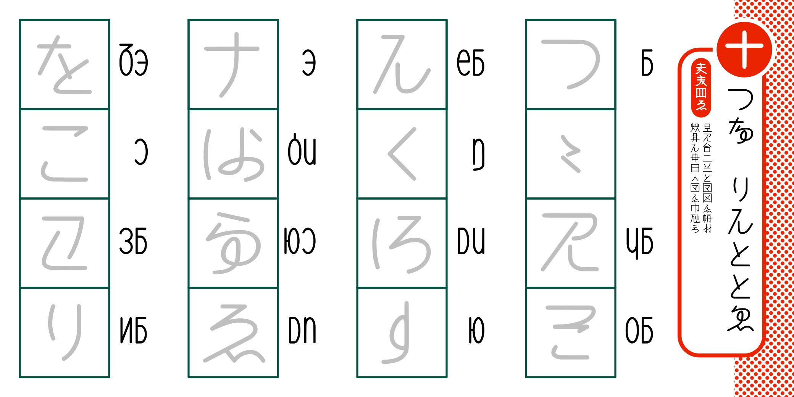

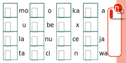


## content

### page 1

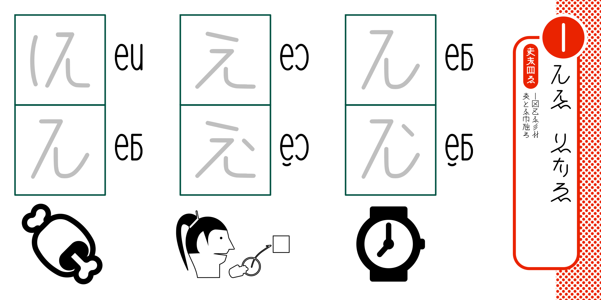

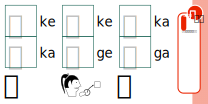

```
かき  ちとし
【かき貝し】

唯一形き貝即
多まき筆能す
```


### page 2

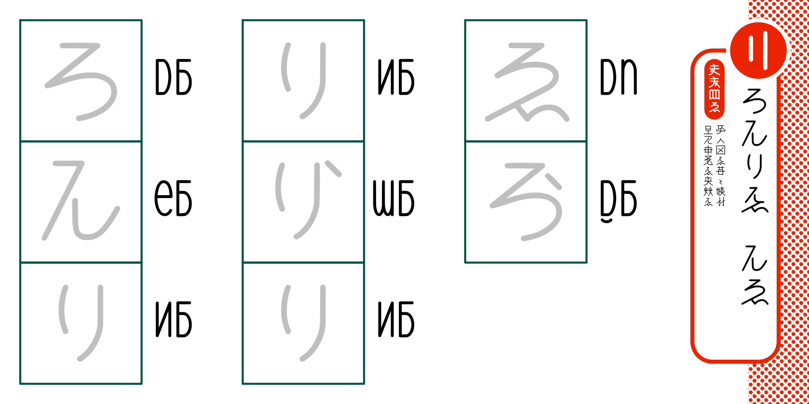

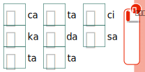

```
さかたき  かし
【さかたき筆し】

使之形き行々増即
子や皇字き善思き
```

### page 3

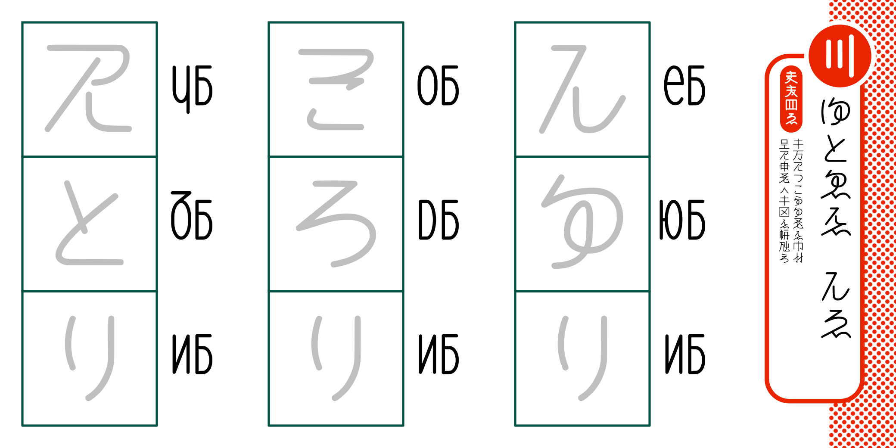

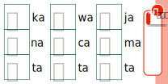

```
ねまにき  かし
【軸字き筆し】

軸声やあうぬな字き筆即
子や皇字之軸形き学能す
```

### page 4

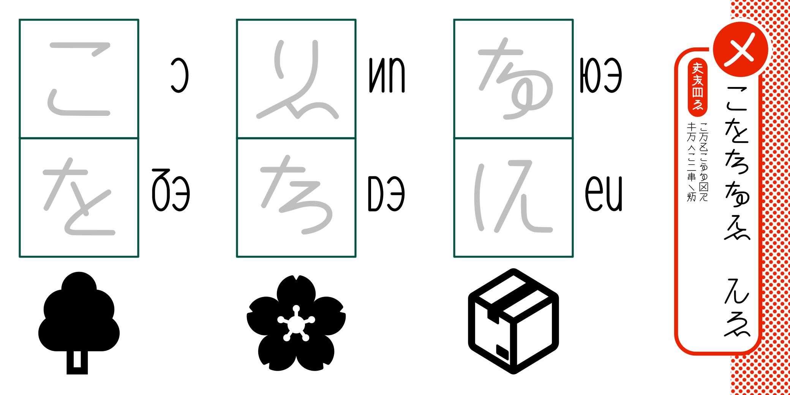

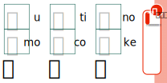

```
うもそのき　かし
【うもそのき筆し】

う声唯うぬな形や
軸声之う処同無噫
```

### page 5

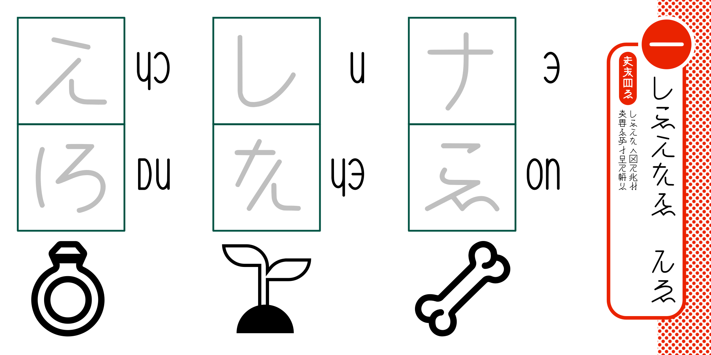

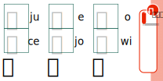

```
えゐゆよき　かし
【えゐゆよき筆し】

えゐゆよ之形や妙即
多時き使而子や学ち
```

### page 6

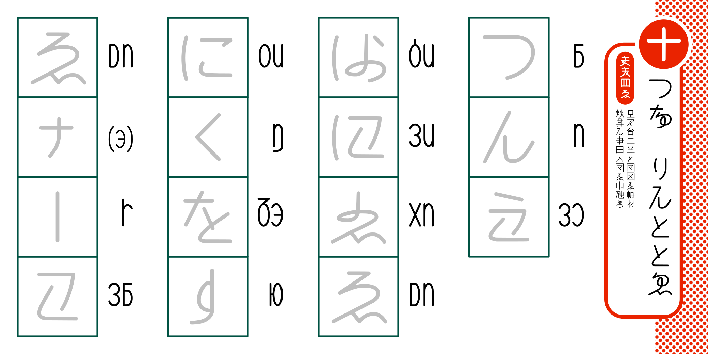

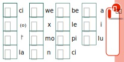

```
あの  たかままに
【全皇字】

子や此処在ま全形き学即
思来か皇言之全き筆能す
```
